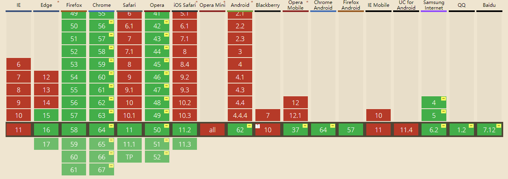

# WebRTC入门教程

WebRTC是为了浏览器之间实现P2P的视频音频消息通话而设计的。  
WebRTC 不仅应用在浏览器中，还应用在了各种 App 上，包括 WhatsApp、Facebook Manager、appear.in 和 TokBox 平台上。甚至在 iOS 浏览器上的实验 WebRTC。WebRTC 也被 WebKitGTK+ 和 QT 内置使用。

查一下WebRTC的兼容性



> WebRTC 实现了三个 APIs：
> 1. getUserMedia（获取摄像头数据）
> 2. RTCPeerConnection（通过此对象获取添加ICE，以及数据传输）
> 3. RTCDataChannel（rtc中的消息传输）

## getUserMedia获取摄像头数据

```html
<video src="" autoplay></video>     <!-- 注意不加autoplay会卡住 -->
```

``` javascript
navigator.mediaDevices.getUserMedia({
    audio: false,
    video: true
}).then(function(stream) {
    document.getElementById('video').srcObject = stream;
}).catch(function(error) {
    console.log(error);
});
```

还可以对视频音频的画质进行设置，[配置参数点击这里查看](https://w3c.github.io/mediacapture-main/getusermedia.html#media-track-constraints)

``` javascript
navigator.mediaDevices.getUserMedia({
    audio: false,
    video: {width: {exact: 1280}, height: {exact: 720}}     // 画质为1280x720
}).then(function(stream) {
    document.getElementById('video').srcObject = stream;
}).catch(function(error) {
    console.log(error);
});

// 画质参数
var qvgaConstraints = {     // qvga画质
    video: {width: {exact: 320}, height: {exact: 240}}
};

var vgaConstraints = {     // vga画质
    video: {width: {exact: 640}, height: {exact: 480}}
};

var hdConstraints = {     // HD画质
    video: {width: {exact: 1280}, height: {exact: 720}}
};

var fullHdConstraints = {     // full HD画质
    video: {width: {exact: 1920}, height: {exact: 1080}}
};

var fourKConstraints = {     // 4k 画质
    video: {width: {exact: 4096}, height: {exact: 2160}}
};
```

尚未标准化，所有的webrtc API都需要做兼容性处理：

``` javascript
navigator.getUserMedia = navigator.mediaDevices.getUserMedia ||
                         navigator.mediaDevices.webkitGetUserMedia ||
                         navigator.mediaDevices.mozGetUserMedia ||
                         navigator.mediaDevices.msGetUserMedia;
```

**注意：** 网上有的写法是`navigator.getUserMedia()`，这种写法已经被废弃。

## RTCPeerConnection

实例

```javascript
// 用stun穿透防火墙，以下为几个免费的stun服务器
var servers = {
    'iceServers':[
        {
            'url': 'stun:stun.services.mozilla.com',
            'credential': 'siEFid93lsd1nF129C4o',
            'username': 'webrtcuser'
        },
        {
            'url': 'stun:stunserver.org'
        },
        {
            'url': 'stun:stun.l.google.com:19302'
        }
    ]
};

// 实例化两个对象
let localConnect = new RTCPeerConnection(servers);
let remoteConnect = new RTCPeerConnection(servers);

// 先向本地的Connect中添加数据流，这一步要在绑定onicecandidate事件之前添加
// 添加数据流，对方就能收到，优先UDP，实在不行用TCP
localConnect.addStream(localStream);
remoteConnect.onaddstream = function(ev) {
    video2.srcObject = ev.stream;
}

// 绑定监听自己的ICE是否产生，产生后，就把自己的ICE给到对方，对方写入自己的对象中
localConnect.onicecandidate = function(ev) {
    console.log('localConnect:', ev.candidate);
    if(ev.candidate) {
        // remoteConnect.addIceCandidate(new RTCIceCandidate(ev.candidate));
        remoteConnect.addIceCandidate(ev.candidate);
    }
}
remoteConnect.onicecandidate = function(ev) {
    console.log('remoteConnect:', ev.candidate);
    if(ev.candidate) {
        // localConnect.addIceCandidate(new RTCIceCandidate(ev.candidate));
        localConnect.addIceCandidate(ev.candidate);
    }
}

// 发出一个offer，生成一个decs，术语是SDP（用来描述自己的信息，如视频编码，用户名等）
localConnect.createOffer(function (desc) {
    console.log('desc:',desc);
    localConnect.setLocalDescription(desc);
    remoteConnect.setRemoteDescription(desc);

    // 收到offer以后，被叫用户发起一个answer，同样生成自己的SDP，发送给对方，交换完SDP，才开始交换ICE
    remoteConnect.createAnswer(function (desc2) {
        console.log('desc2:',desc2);
        remoteConnect.setLocalDescription(desc2);
        localConnect.setRemoteDescription(desc2);
    }, errCallback);
}, errCallback);

```

上述例子中，两个对象的SDP和ICE因为在同一个页面中，所以可以直接交换。

真实的情形是两个用户通过websocket连接同一台服务器，两个对象把各自的SDP和ICE都发送给服务器，服务器来转发SDP和ICE，两者交换好信息后，不再依赖于服务器，而是实现P2P的直连，不仅是发送视频音频，还能通过RTCDataChannel交换消息，文件，图片等一切数据的发送。

## [信令](https://developer.mozilla.org/zh-CN/docs/WebRTC/%E4%BB%8B%E7%BB%8D)

**我个人的理解：信令是两个用户连通之前，交换的所有的信息统称为信令，包括SDP,ICE,采用的协议等。。。如果不想深究，可以跳过这一段，大致了解概念即可**

信令期间需要交换的信息有三种基本类型：

1. 用于设置，打开和关闭通信通道的控制消息，并处理错误。
2. 为了建立连接所需的信息：对等体能够彼此交谈所需的IP寻址和端口信息。
3. 媒体能力协商：同行可以了解哪些编解码器和媒体数据格式？ 在WebRTC会议开始之前，需要达成一致。

开发者可以为应用程序引擎选择任意的信息协议（如SIP或XMPP），任意双向通信信道（如WebSocket或XMLHttpRequest)与持久连接服务器的API（如Google Channel API）一起工作。

### [交换SDP---会话描述descriptions](https://developer.mozilla.org/zh-CN/docs/Web/API/WebRTC_API/Signaling_and_video_calling#Exchanging_session_descriptions)

`type:` 这个字段不是"offer"就是"answer".  
`name:` 这个字段是用户名  
`target:` 目标用户名  
`sdp:` 自己的SDP信息（分辨率，格式，编码，加密算法，ip地址）.

> At this point, the two participants know which codecs and video parameters are to be used for this call. They still don't know how to transmit the media data itself though. This is where Interactive Connectivity Establishment (ICE) comes in.  
（这个时候，两者知道这次对话中，对方的编解码器和视频参数，但是他们还是不知道怎么传输数据，这个时候就要依靠ICE了）

### [交换ICE候选](https://developer.mozilla.org/zh-CN/docs/Web/API/WebRTC_API/Signaling_and_video_calling#Exchanging_ICE_candidates)

`type`: "new-ice-candidate".  
`target`: 目标用户名.  
`candidate`: 描述建议的连接方法（The SDP candidate string, describing the proposed connection method.）

> **ICE：** STUN（会话穿越功能），NAT（网络地址转换协议），TURN（NAT的中继穿越方式），SDP（会话描述协议，分辨率，格式，编码，加密算法等，所以在数据传输时两端都能够理解彼此的数据）

> Generally, ICE candidates using TCP are only going to be used when UDP is not available or is restricted in ways that make it not suitable for media streaming. Not all browsers support ICE over TCP, however.  
> 通常ICE候选优先使用UDP，只有UDP不可用或者不适合当前媒体的传输的时候，才会使用TCP，但是不是所有的浏览器都支持RTC的TCP连接

## RTCDataChannel

RTCDataChannel采用和websocket类似的事件写法

发送消息

```javascript
var pc = new RTCPeerConnection();
var channel = pc.createDataChannel("my channel");

/* channel.onmessage = function (event) {   // 注意：这个事件不存在，参见注意2
    console.log("received: " + event.data);
}; */

channel.onopen = function () {
    console.log("datachannel open");
};

channel.onclose = function () {
    console.log("datachannel close");
};
```

接收消息

```javascript
    remoteConnection = new RTCPeerConnection();
    remoteConnection.ondatachannel = function(event) {
        receiveChannel = event.channel;
        receiveChannel.onmessage = function (event) {
            console.log("received: " + event.data);
        };;
        receiveChannel.onopen = handleReceiveChannelStatusChange;
        receiveChannel.onclose = handleReceiveChannelStatusChange;
    };
```

**注意1：** RTCDataChannel对象要在绑定onicecandidate事件之前创建，onmessage,onopen,onclose事件也要在绑定onicecandidate事件之前绑定好，不然两个RTCDataChannel连接不上

**注意2：** MDN的资料上显示有这个事件，但是实际测试chrome不能这样接受消息，必须通过ondatachannel产生的event来获取receiveChannel对象。

## [WebSocket和WebRTC的区别](https://stackoverflow.com/questions/18799364/webrtc-vs-websockets-if-webrtc-can-do-video-audio-and-data-why-do-i-need-web)

**WebRTC**是为了高性能，高质量的视频音频以及任意数据的传输而设计的，它需要一台服务器来交换信令，但是一旦信令交换完毕，两台设备直接建立连接，视频音频数据直接在两台设备间传输，避免了通过中间服务器传输的性能成本。

**WebSocket**是为了服务器和客户端之间的连接而设计的，你同样也可以通过WebSocket来传输视频音频的数据流（[这里有一个例子](https://stackoverflow.com/questions/4241992/video-streaming-over-websockets-using-javascript)），但是它数据流API的设计并不像WebRTC那么健壮高效，所以WebSocket更适合用来发送消息。

最后这里有[一些资料](https://docs.google.com/document/d/1idl_NYQhllFEFqkGQOLv8KBK8M3EVzyvxnKkHl4SuM8/edit)，强烈建议你看一下2013年 Google I/O 大会[上关于 WebRTC 的视频](http://www.youtube.com/watch?v=p2HzZkd2A40)（自备梯子）

## [应用拓展](https://webrtc.github.io/samples/)

WebRTC可以和canvas结合使用，可以捕获canvas的数据流，然后映射到video标签中，这里有[一个例子](https://webrtc.github.io/samples/src/content/capture/canvas-pc/)

```javascript
var canvas = document.querySelector('canvas');

// 从canvas获取数据流
// 设置双精准度浮点值为每个帧的捕获速率。如果未设置，则每次画布更改时都会捕获一个新帧。如果设置为0，则会捕获单个帧。
var stream = canvas.captureStream(25); // 25 FPS

// pc是RTCPeerConnection实例化后的一个对象
pc.addStream(stream);
```

不仅局限于实时传输，我们还可以记录保存一段canvas数据（相当于制作一段视频），再在video标签中播放，这是另外的[一个例子](https://webrtc.github.io/samples/src/content/capture/canvas-record/)。

```javascript
var canvas = document.querySelector('canvas');
var video = document.querySelector('video');
var stream = canvas.captureStream();

var mediaRecorder = new MediaRecorder(stream, {mimeType: 'video/webm'});
var recordedBlobs = []; // 存放记录后的数据

// 有数据被记录时，就出发这个事件
mediaRecorder.ondataavailable = function(event) {
  if (event.data && event.data.size > 0) {
    recordedBlobs.push(event.data);
  }
}；
mediaRecorder.start();

// 录制10秒的视频
setTimeout(function() {
    mediaRecorder.stop();

    // 创建buffer
    var superBuffer = new Blob(recordedBlobs, {type: 'video/webm'});
    video.src = window.URL.createObjectURL(superBuffer);
},10000)
```

总结：WebRTC的一些APIs创建和绑定时是有先后顺序的，一定要格外注意。在实际的应用中通过服务器来交换信令，可以用ajax，websocket等，形式不限，另外还可以扩展为[sip协议](http://www.cnblogs.com/gnuhpc/archive/2012/01/16/2323637.html)，我使用的库是[sip.js](https://sipjs.com/)，相对于[jssip](http://jssip.net/)，sip.js提供[免费的服务器](https://developer.onsip.com/)，注册账号后就能免费通话。