# 数据结构

## 绪论

1. 数据的逻辑结构分为4类：集合、线性结构、树形结构、图形结构。
2. 存储结构分为4种：顺序存储（数组）、链式存储（链表）、索引存储（索引表）、散列存储（散列函数 哈希表）
3. 数据结构的表示：L=(D,R), D={1, 2, 3, 4}, R={r}, r={<1,2>, <2,3>, <3,4>}

## 线性表

- 线性表分为顺序存储和链式存储两种：数组、循环数组、单链表、循环链表、双向链表、静态链表。
- 浪费一个单位作为虚拟头节点，可以简化操作。
- 应用场景之一是循环队列
- 静态链表利用数组定义

        | 索引 | 数据域 | 指针域 |
        |------|-------|--------|
        |  0   |       |   3    |
        |  1   |   32  |   5    |
        |  2   |   56  |   4    |
        |  3   |   89  |   1    |
        |  4   |   50  |   -1   |
        |  5   |   42  |   2    |

## 二分搜索树

- 使用场景是快速查找
- 二分搜索中序遍历能直接得到 **排序** 好的数据
- 后序遍历使用场景之一是内存释放，先释放他的子集，最后释放自己
- 可以使用了栈的数据结构，实现二分搜索的 **前序** 非递归算法遍历方法，中序和后序实现起来过于复杂，且应用不广泛。
- 二分搜索树的复杂度为O(lgn)级别的，和深度有关，即O(h)
- 使用场景：Set结构或Map结构
- 节点必须要有可比较性

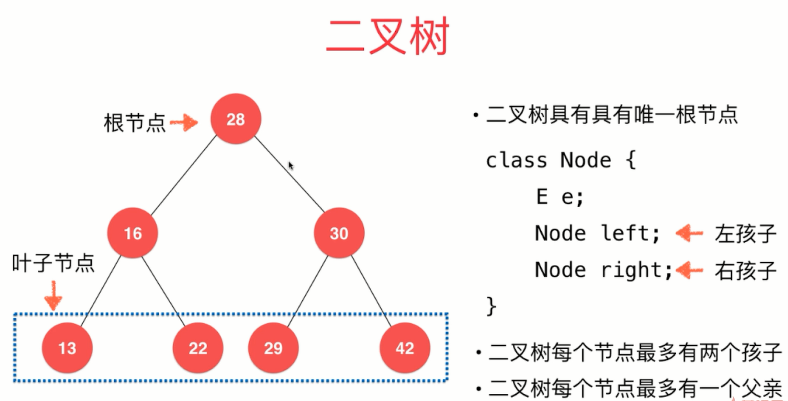

## 堆

- 最大堆的实现是一个完全二叉树
- 完全二叉树可以根据父子索引的关系，存在数组中
- 存采用上浮，取采用下沉，都是O(lgn)级别的
- 应用场景：优先队列
- Java中的PriorityQueue优先队列

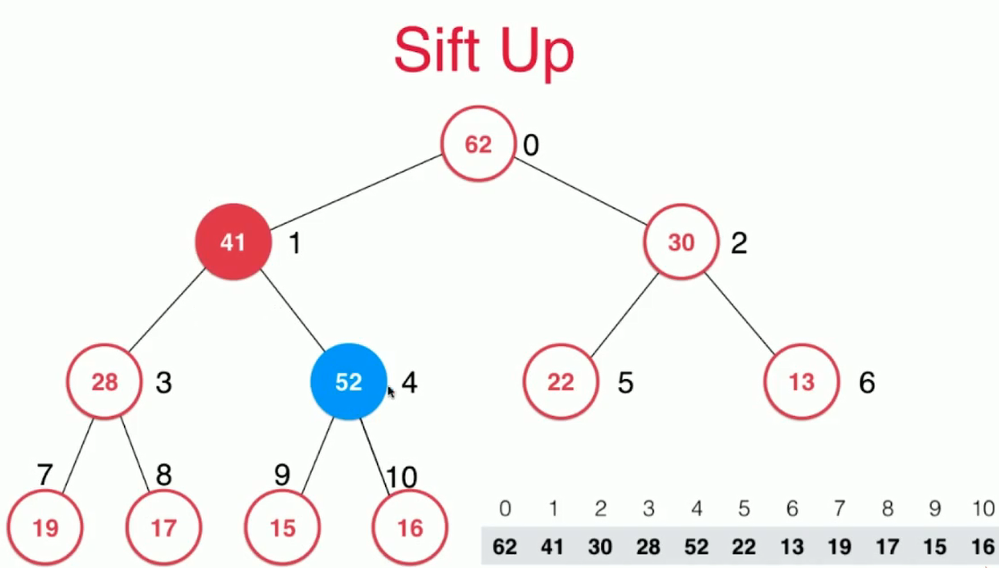

## 线段树

- 用于基于区间的动态数据求和
- n个元素，需要4n的空间来存储
- 区间必须固定，即n必须固定
- 是平衡二叉树

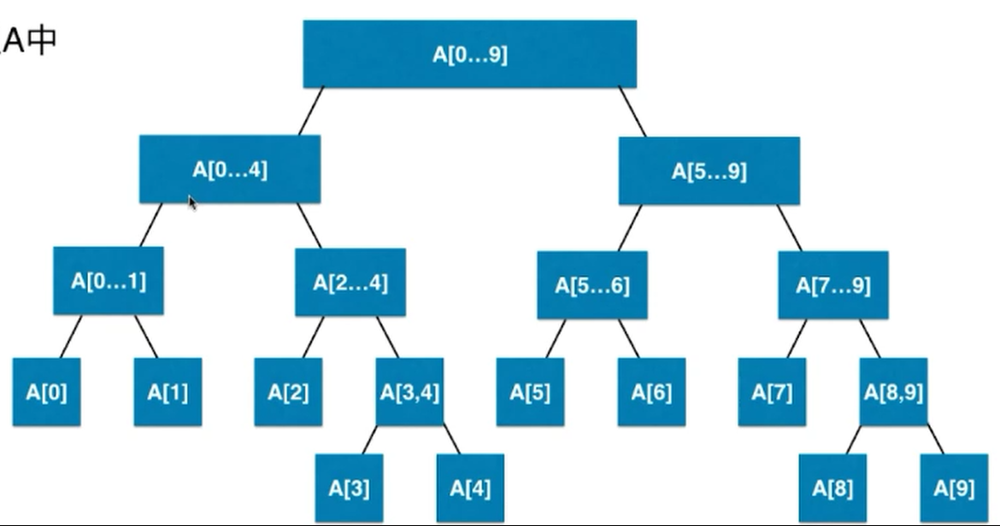

## Trie

Trie是一个多叉树（字典树或前缀树），比二分搜索树好，文本越大，性能越好，缺点是浪费空间，用来存储字符串。

```java
private class Node {
        private boolean isWord;
        private TreeMap<Character, Node> next;  //平衡二叉树

        public Node(boolean isWord) {
                this.isWord = isWord;
                this.next = new TreeMap<Character, Node>();
        }

        public Node() {
                new Node(false);
        }
}
```

压缩字典树，维护成本更高，但节省了空间。

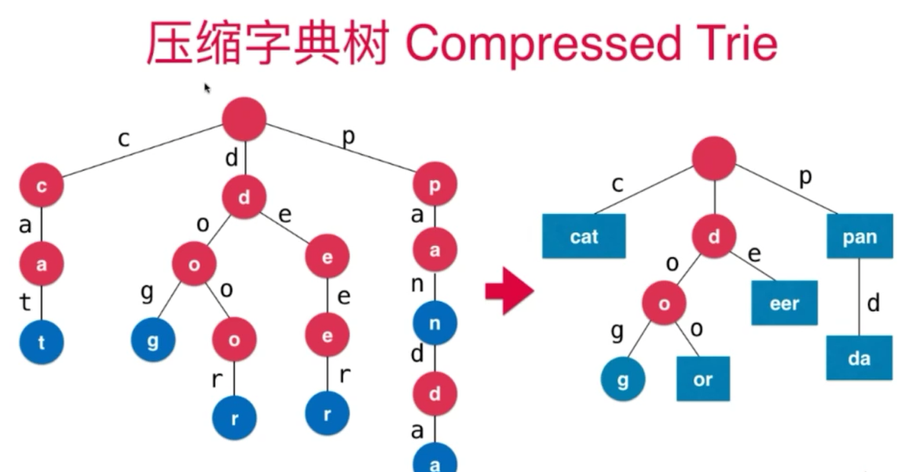

## 并查集

- 用于存储集合，合并集合，查询是否是同一个集合
- 查询是否是同一个集合的复杂度为O(h)
- 优化思路1：合并操作的时候，比较连个集合的深度，将深度低的连接到深度高的集合上
- 优化思路2：路径压缩

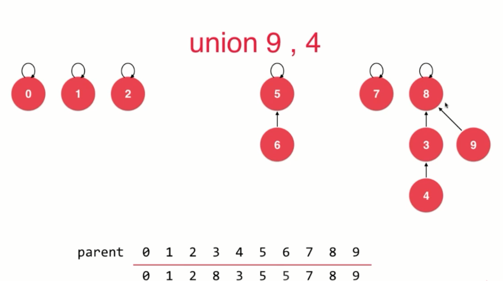
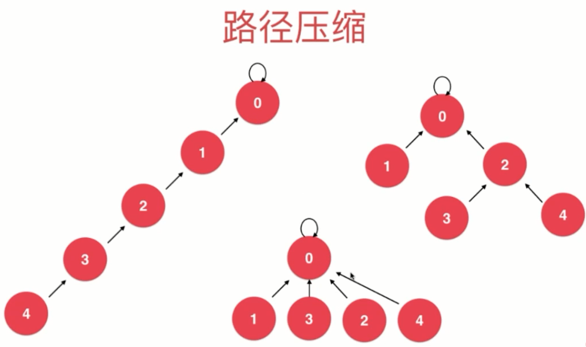

## 平衡二叉树

- 任意一个节点的左子树和右子树高度差不超过 1

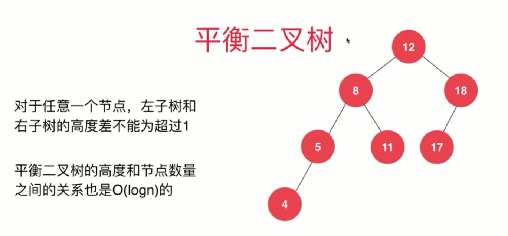

- 计算平衡因子：左右子树的高度差的绝对值不能超过 1，超过 1 说明不平衡

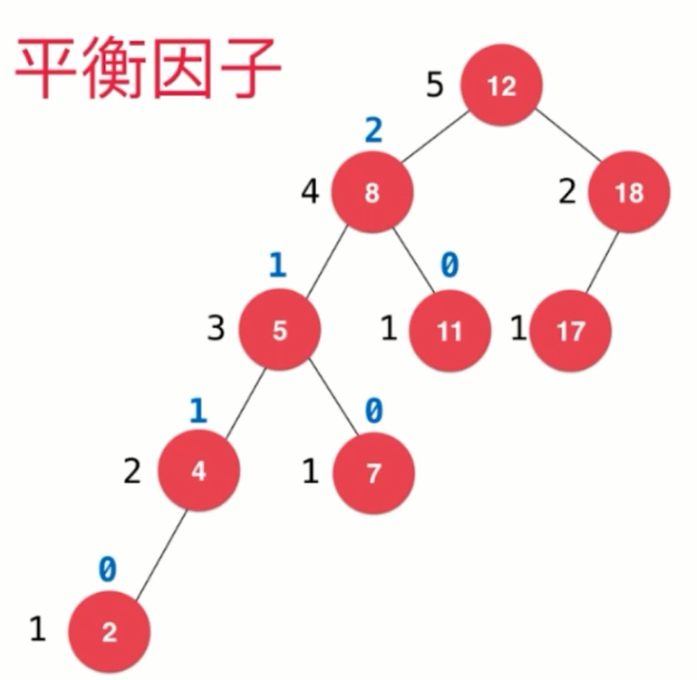

## AVL

- 维护一个height，插入或删除节点的时候，根据平衡因子，判断是否是平衡树，如果不平衡，通过调整根节点，使树始终保持平衡状态

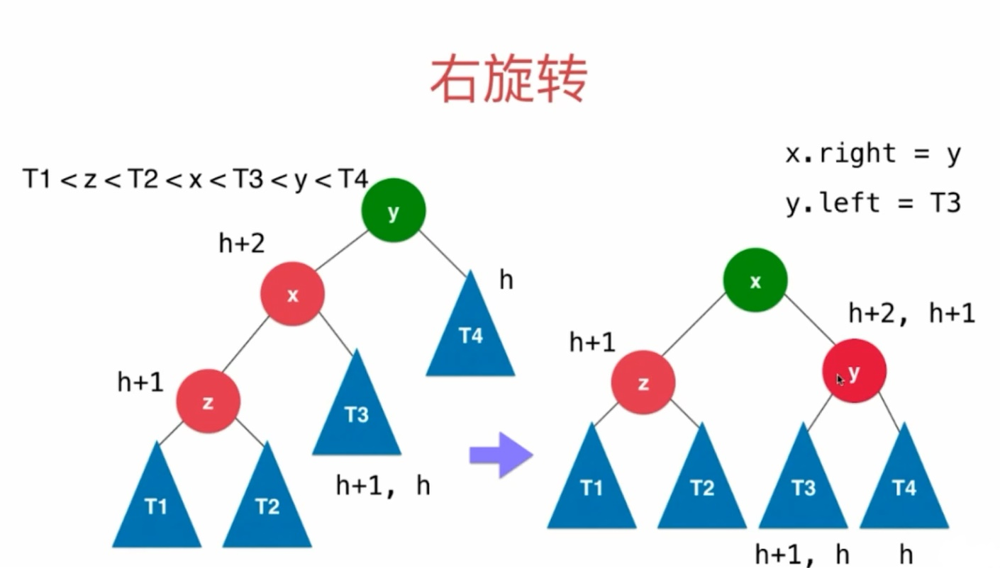

## 2-3树

- 满足二分搜索树的性质
- 每个节点可以存放一个或两个元素
- 每个节点有两个或者三个节点
- 是一个绝对平衡树，即从根节点到任意一个叶子节点，经过的节点数是相同的

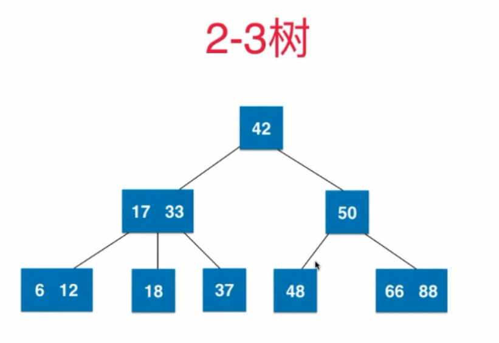

2-3树是如何维持绝对平衡的？

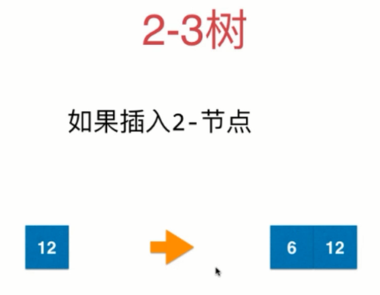
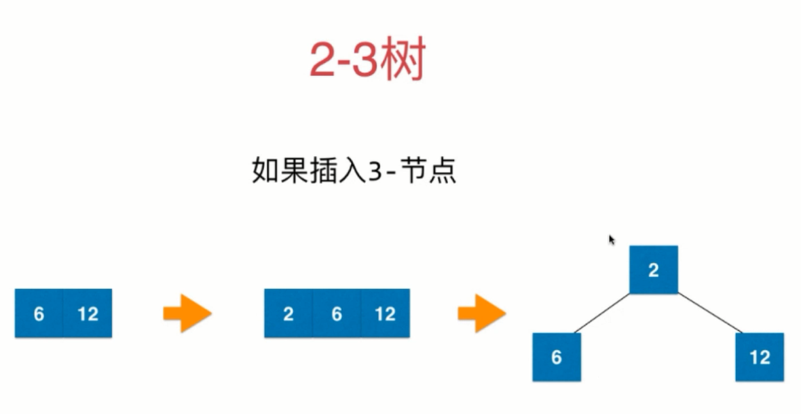
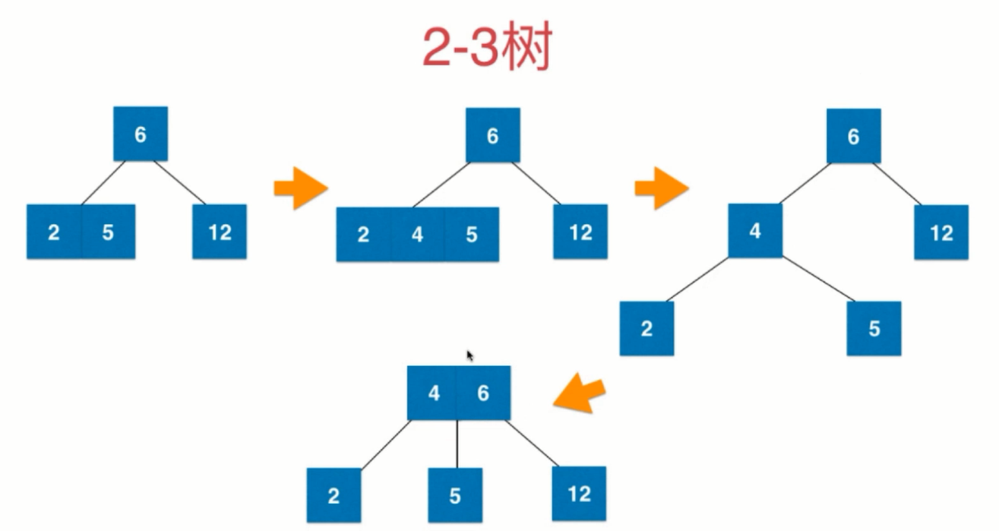
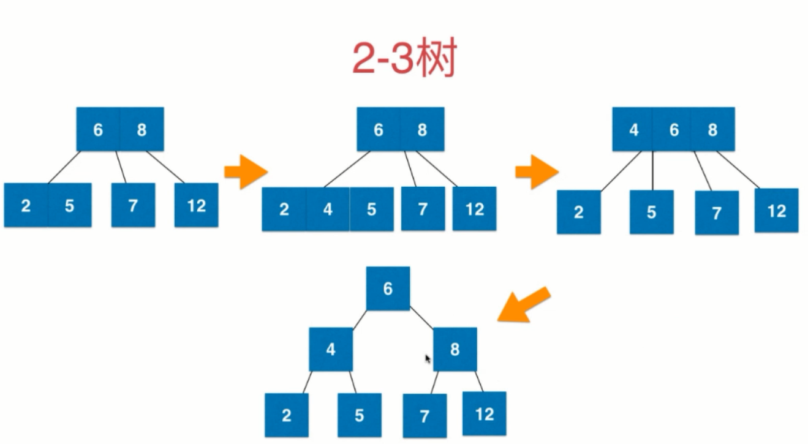

## 红黑树

### 定义

1. 每个节点不是红色就是黑色
2. 根节点使黑色的
3. 每个叶子节点（最后的空节点）是黑色的
4. 如果一个节点使红色的，那么他的孩子节点都是黑色的
5. 从任意一个节点到叶子节点，经过的黑色的节点是一样的

### 性质

- 时间复杂度是O(lgn)级别的
- 红黑树是保持“黑平衡”的二叉树
- 最大高度是2logn，所以查找时性能略低于AVL树，但是增加和修改元素的性能比AVL好
- 红黑树和2-3树是对照等价的
- 保持平衡的过程和AVL树差不多，都是通过旋转

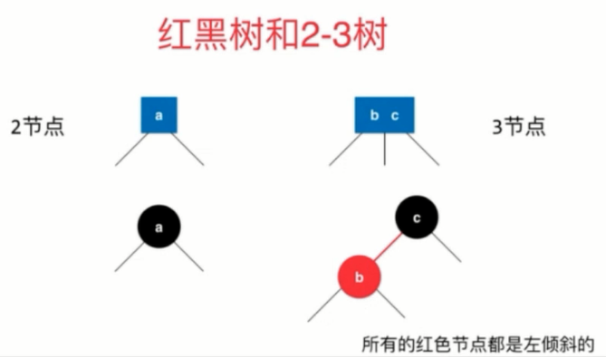

## 哈希表

- 思想是空间换时间
- 将数据存储到数组中，“键”通过哈希函数转换为“索引”，再通过索引直接访问数组，时间复杂度为O(1)
- 哈希函数的设计很重要，希望通过键得到的索引越均匀越好，不同的领域有不同的做法
- 很难保证每一个“键”通过哈希函数都产生唯一的索引，所以需要解决哈希冲突
- 哈希表是时间和空间之间的平衡，数组所开空间的大小影响哈希表的执行效率

实例：  
身份证号110108198512166666  
如果我们有999999999999999999的空间，我们可以在O(1)的时间复杂度完成各项操作  
如果我们只有1个空间，我们只能用O(n)的时间复杂度完成操作（线性表）  
所以哈希表是时间和空间之间的平衡

### 哈希函数的设计

如果是整数存储，通常的做法是取模，并且模上一个素数，会使索引分布更加均匀，具体素数，可以查阅[此链接](http://planetmath.org/goodhashtableprimes)

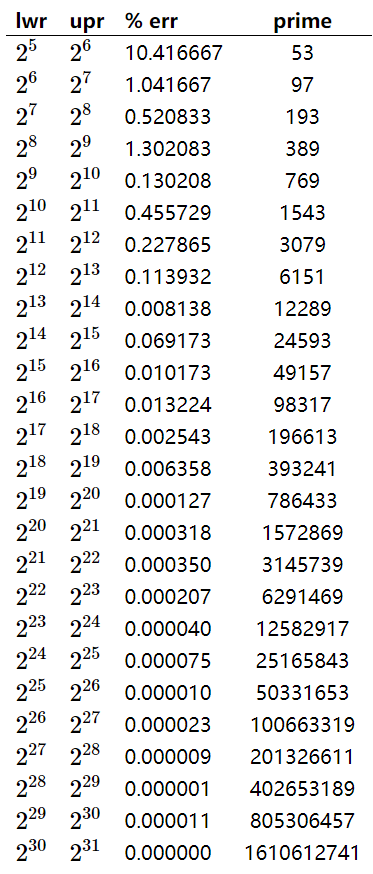

如果是浮点型，计算机都是用32位或64位二进制存储的，所以可以转换为整型  
如果是字符串，可以将每个字符看成是26进制，也可以转换成整型

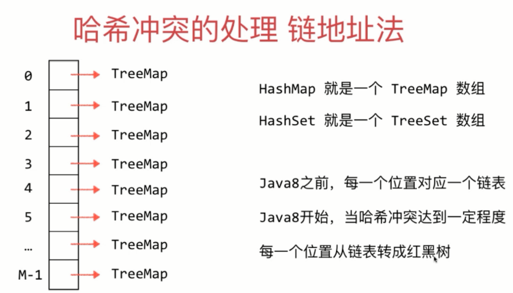